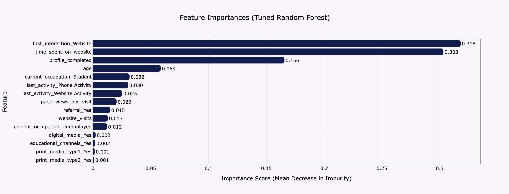
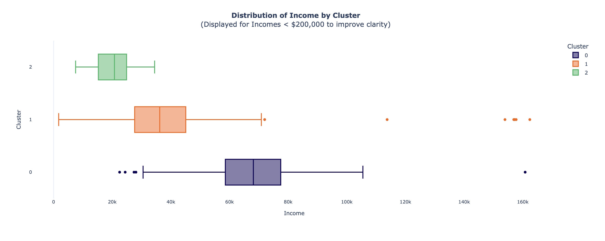

# Arif Pazhwak | Data Analytics Portfolio

Hello! I am a researcher with a Master's in Political Economy from NYU, now transitioning into the field of data science. I have a passion for applying rigorous analytical and machine learning techniques to solve practical business problems. 

This portfolio showcases selected projects where I have leveraged data to drive insights, build predictive models, and create strategic value.

### Core Competencies & Tools

  
  
  
  
  
  
  
  
  
  
  

---

### 1. Gigapower — EV-Battery Site-Selection Framework

* **Project Summary:** Developed a Gigafactory Attractiveness Index (GAI) to identify the optimal location for a $500M EV-battery gigafactory. This project harmonized five open-source datasets to score and rank 80 countries on strategic pillars including cost, risk, and supply-chain readiness, providing a data-driven recommendation for a major investment decision.
* **Skills & Tools:** `Python`, `Plotly`, `Scikit-learn`, `Pandas`, `K-Means Clustering`, `Index Creation`, `Data Harmonization`, `Scenario Analysis`.
* **Links:**
    * **[View Source Code on GitHub](https://github.com/arifpazhwak/gigapower-ev-battery-site-selection)**

---

### 2. Lead Conversion Prediction with Ensemble Models

* **Project Summary:** This project addresses a key business challenge for an EdTech company: identifying which leads are most likely to convert. I developed a machine learning pipeline to score and prioritize leads, using a Random Forest model that achieved 88% recall, ensuring that high-potential customers are effectively targeted by the sales team.
* **Skills & Tools:** `Python`, `Pandas`, `Scikit-learn`, `Plotly`, `Classification`, `Decision Trees`, `Random Forest`, `Ensemble Methods`, `Hyperparameter Tuning`, `Feature Engineering`.
* **Visual:**
    
* **Links:**
    * **[View Source Code on GitHub](https://github.com/arifpazhwak/lead-conversion-prediction-ensemble)**

---

### 3. Retail Customer Segmentation using K-Means Clustering

* **Project Summary:** To help a retail company move beyond generic marketing, I used K-Means clustering to segment their customer base. This analysis uncovered three distinct personas—including "The Affluent Achievers" and "The Family-Focused Navigators"—providing a data-driven foundation for developing personalized marketing campaigns and retention strategies.
* **Skills & Tools:** `Python`, `Scikit-learn`, `K-Means Clustering`, `Unsupervised Learning`, `Plotly`, `Customer Persona Development`, `Data Visualization`, `Feature Scaling`, `Log Transformation`.
* **Visual:**
    
* **Links:**
    * **[View Source Code on GitHub](https://github.com/arifpazhwak/customer-segmentation-retail-project)**

---

### 4. Amazon Product Recommendation System

* **Project Summary:** This project involved building and evaluating multiple recommendation algorithms on an Amazon electronics dataset. The final model, a tuned Singular Value Decomposition (SVD) system, achieved the lowest prediction error (RMSE of 0.88) and excellent top-10 recommendation quality, demonstrating the power of matrix factorization in creating a personalized user experience.
* **Skills & Tools:** `Python`, `Surprise`, `Recommendation Systems`, `Collaborative Filtering`, `Matrix Factorization (SVD)`, `RMSE`, `Precision/Recall@k`, `Hyperparameter Tuning`, `Plotly`.
* **Results Table:**
    | Model                   | RMSE   | Precision@10 | Recall@10 | F1-score@10 |
    | :---------------------- | :----- | :----------- | :-------- | :---------- |
    | User-User CF (Baseline) | 1.0012 | 0.856        | 0.858     | 0.856       |
    | Item-Item CF (Tuned)    | 0.9576 | 0.839        | 0.880     | 0.859       |
    | SVD (Baseline)          | 0.8894 | 0.849        | 0.877     | 0.863       |
    | **SVD (Tuned)** | **0.8887** | **0.853** | **0.871** | **0.862** |
* **Links:**
    * **[View Source Code on GitHub](https://github.com/arifpazhwak/Amazon_Recommendation_System)**

---

Thank you for visiting my portfolio. I am eager to apply my skills to new challenges in data analytics and consulting. Please feel free to connect with me on [LinkedIn](https://www.linkedin.com/in/arifpazhwak/).
